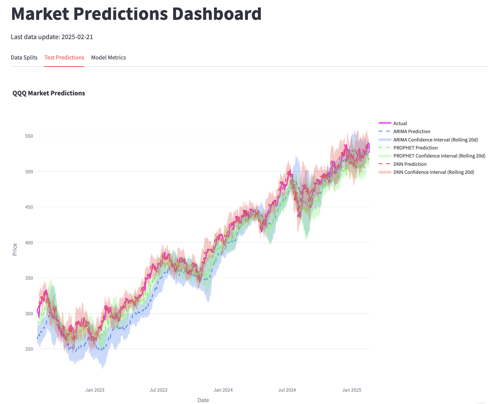

# ML Workshop February 2025

🚀 **Try the live dashboard: [Market Predictions Dashboard](https://trendcast.streamlit.app/)**


*Test Predictions Dashboard showing model forecasts and actual market data*

**📺 Watch Workshop Recording [Coming Soon]()**

This repository contains materials for the Machine Learning Workshop focused on financial time series prediction. The workshop explores three different approaches to predicting stock prices: ARIMA, Prophet, and Deep Neural Networks.

## Introduction

Hi I'm **Ivan Brigida** an Analyst at Google with a background in **Economics** and **Data Analysis**. Before joining Google I worked in the banking sector and 3 years ago I started investing in **U.S. markets** while living in **Ireland**. My work and investing experience focus on using **economic data** to understand the economy, make financial decisions, and develop market strategies. You can read my latest article about [using LLMs for long-term financial news analysis](https://pythoninvest.com/long-read/long-term-financial-news-using-llms), and find more articles at [pythoninvest.com/blog](https://pythoninvest.com/blog).

Last year I ran the **[Stock Markets Analysis Zoomcamp](https://pythoninvest.com/course)** which attracted **1800+ registrations**. I'll be running it again in **2025** you can express your interest here:

<p align="center">
  <a href="https://pythoninvest.com/course"></a>
</p>

## 🙌 Support PythonInvest

Help us grow and improve PythonInvest:

1. **Engage**: 🌟 Star this repo, 👍 like the video and 💬 comment on YouTube.
2. **Contribute**: 🍴 Fork the repo, try it, tweak the indicators and share feedback with a link.
3. **Donate**: ☕ [Buy Me a Coffee](https://buymeacoffee.com/pythoninvest) or ❤️ [GitHub Sponsorship](https://github.com/sponsors/realmistic).

This workshop builds on our [previous workshop](https://github.com/realmistic/economics-workshop-dec-2024) which focused on data collection and visualization. The [Economics Dashboard](https://economics-workshop-dec-2024.streamlit.app/) from that workshop is still updated weekly through GitHub Actions and runs on Streamlit Cloud, demonstrating the full pipeline from data collection to deployment. Similarly, this workshop's [Market Predictions Dashboard](https://trendcast.streamlit.app/) is also updated daily with the latest predictions.

Like the previous workshop, this project extensively utilized AI-assisted development (~$112 in AI costs) using:
- [Cline Extension for VS Code](https://marketplace.visualstudio.com/items?itemName=saoudrizwan.claude-dev)
- Anthropic Claude 3 Sonnet (20241022)

The AI assistance accelerated:
- Code implementation and replication across models
- Documentation generation and maintenance
- Model comparison and analysis
- Bug fixing and optimization

For details on how AI was used in development, see [REPRODUCTION.md](REPRODUCTION.md).

While the previous workshop covered Docker containerization and cloud deployment options, this session focuses purely on modeling techniques. We'll use Streamlit Community Cloud for simple deployment, without diving into Docker or other cloud platforms. This allows us to concentrate on the core machine learning concepts and model comparison.

### Workshop Goals
- Compare traditional and modern approaches to time series prediction
- Understand the strengths and limitations of each model type
- Learn practical feature engineering for financial data
- Develop intuition for model selection and evaluation

## Workshop Content

The workshop demonstrates a progression from simple to complex modeling approaches:

### 1. Modern Decomposition with Prophet
- Quick-start solution with minimal code
- Built-in trend and seasonality decomposition
- Simple parameter tuning and configuration
- Excellent baseline for time series prediction

### 2. Statistical Modeling with ARIMA
- Classic ARIMA(2,1,2) approach
- Strong theoretical foundation
- Detailed model interpretation
- Integration with market indicators

### 3. Deep Learning with TensorFlow
- Sophisticated feature engineering
- Careful architecture optimization (8->8 units)
- Returns-based prediction approach
- Complex regularization and training process

### 4. Model Evaluation Framework
- Trading metrics implementation
- Risk-adjusted returns analysis
- Performance comparison methodology

For detailed implementation steps and code examples, see [REPRODUCTION.md](REPRODUCTION.md).

## Requirements

- Python 3.12 or higher
- TensorFlow 2.16.2 (stable version with Python 3.12 support)
- Additional packages listed in requirements.txt

## Setup

1. Create a virtual environment:
```bash
python -m venv .venv
```

2. Activate the virtual environment:
- On Windows:
```bash
.venv\Scripts\activate
```
- On macOS/Linux:
```bash
source .venv/bin/activate
```

3. Install the required packages:
```bash
pip install -r requirements.txt
```

## Project Structure

```
.
├── app/
│   └── main.py                 # Streamlit dashboard application
├── data/
│   └── market_data.db         # SQLite database with market data and predictions
├── notebooks/
│   ├── prophet_experiment.ipynb  # Quick-start Prophet analysis
│   ├── arima_experiment.ipynb    # Statistical ARIMA modeling
│   └── dnn_experiment.ipynb      # Advanced Deep Learning approach
├── scripts/
│   ├── init_db.py             # Database initialization script
│   ├── update_data.py         # Market data update script
│   ├── train_models.py        # Model training pipeline
│   └── models/
│       ├── arima_model.py     # ARIMA model implementation
│       ├── prophet_model.py   # Prophet model implementation
│       └── dnn_model.py       # Deep Neural Network model
├── static/
│   └── images/                # Project images and screenshots
└── .github/
    └── workflows/             # GitHub Actions automation
```

## Running Locally

After installing the requirements, you can:

1. Initialize the database:
```bash
python scripts/init_db.py
```

2. Update market data:
```bash
python scripts/update_data.py
```

3. Train models and generate predictions:
```bash
python scripts/train_models.py
```

4. Run the Streamlit dashboard:
```bash
streamlit run app/main.py
```

The dashboard will be available at http://localhost:8501

## Model Comparison

### Test Set Performance

#### Prophet
- Win Rate: ~51.2%
- Market outperformance: +1.1%
- Average returns: 0.21%
- P/L ratio: 1.15

#### ARIMA
- Win Rate: ~54.5%
- Market outperformance: +3.3%
- Average returns: 0.42%
- P/L ratio: 1.45

#### DNN
- Win Rate: ~58.1%
- Market outperformance: +1.3%
- Average returns: 0.38%
- P/L ratio: 1.12

## Contributing

We welcome contributions! Here's how you can help:
- Star ⭐ this repository to show your support
- Submit issues for bugs or enhancement ideas
- Fork the repository and submit pull requests
- Share your model improvements and feature ideas

## License

See the [LICENSE](LICENSE) file for details.
